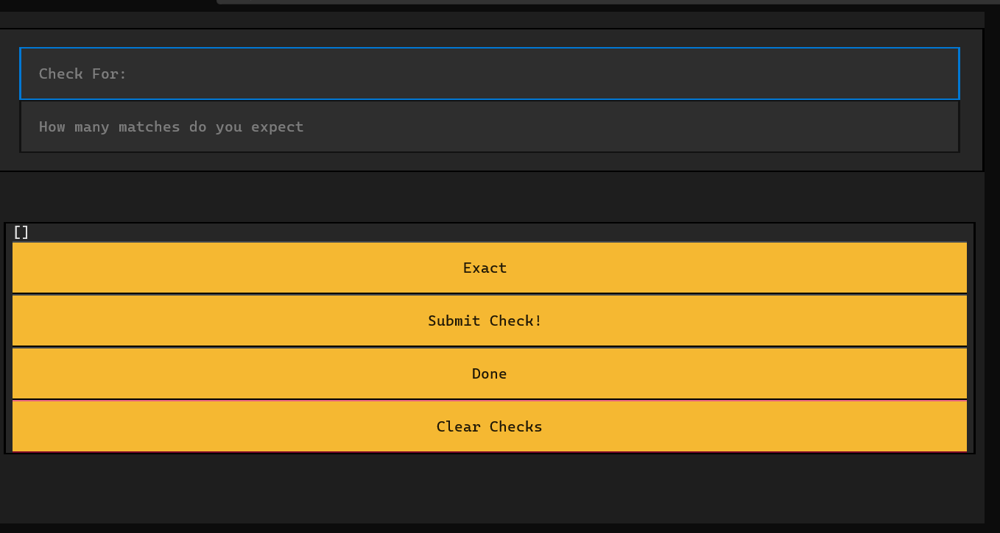
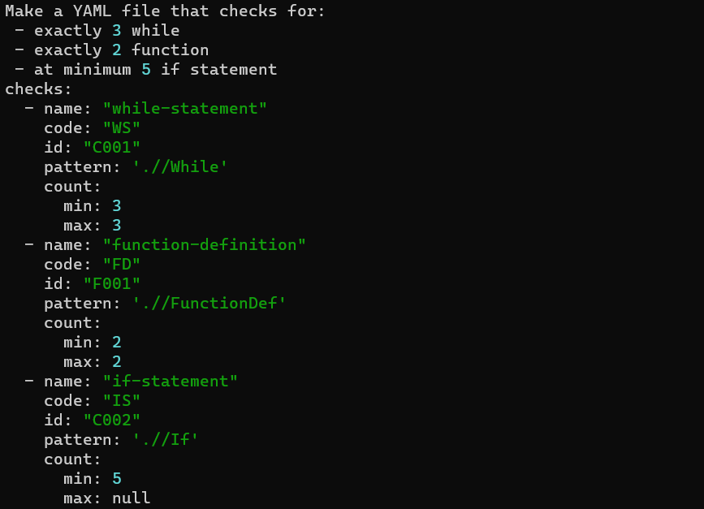

`chasten create-checks`

Which will then display a textual app the code for which is in the **configApp.py** file:

### App Example

It will also prompt for an API key if one has not been given already just through a terminal input which it will then store an encrypted version into a text file using fernet.

The code than takes the inputs given by the user and stores it in a csv file split that information up when then the app is closed and use the **write_checks** function in **configApp.py** to format it in way to have consistently formatted inputs to send to chatGPT in an attempt to make the program more consistent.

It then displays the checks and sends the information to chatGPT and gets the results which is handled in the **createchecks.py** file and then displays the results in the terminal and stores it in a YAML file called **checks.yml** or whatever the user specify.

### Output Example

