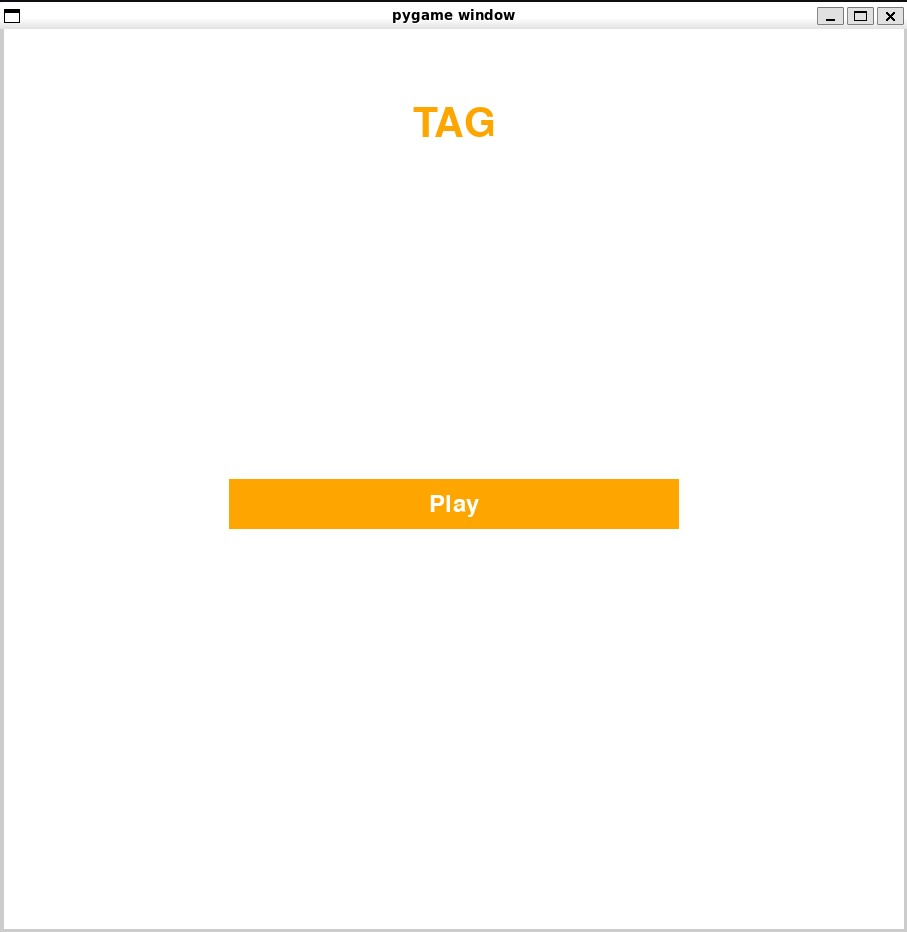
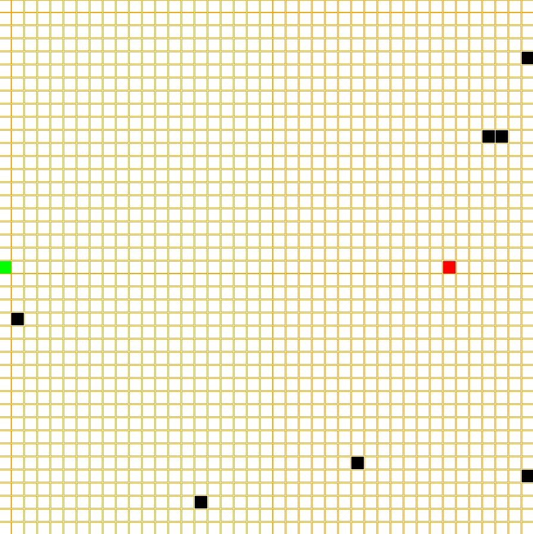

### Title Screen



### Board



> This shows an early state of the game as the game continues more obstacles will appear which are the black squares.

### Goal

**You** are the **green** square and your goal is to survive as long as possible and in turn earn as many points as possible.
> You lose if the red square catches you

### Controls

**W**: Go up
**A**: Go left
**S**: Go down
**D**: Go right
>If you've ever played snake it moves very similar where you go in the direction of key you press until you specify otherwise.

## How it works

### Board

The game generates a board of forty by forty with the starting location of the player being opposite of each other.  Everything in this game is coordinate based and stores obstacles coordinates, player coordinates and enemy coordinates and changes the color of the associated square depending on those locations

```python
  tile_size = width / board_size
        tile_origin = (0, 0)
        tiles = []
        for i in range(board_size):
            row = []
            for j in range(board_size):
                rect = pygame.Rect(
                    tile_origin[0] + j * tile_size,
                    tile_origin[1] + i * tile_size,
                    tile_size,
                    tile_size,
                )
                if (i, j) == user.location:
                    # Draw Player character
                    pygame.draw.rect(screen, "green", rect)
                elif (i, j) == enemy.location:
                    # Draw Enemy
                    pygame.draw.rect(screen, "red", rect)
                elif (i, j) in obstacles:
                    # Draw Obstacle
                    pygame.draw.rect(screen, "black", rect)
                else:
                    pygame.draw.rect(screen, "orange", rect, 1)
                row.append(rect)
            tiles.append(row)
```

### Player

The **player** is a class and is the simplest part of the program it has a **location** and **direction**.

* **Location:** Current location of player
* **Direction:** Direction player is currently moving

All the program does is respond to key presses and changes the direction and location accordingly.

```python
class player:
    def __init__(self, location: Tuple[int, int], direction: str | None):
        self.location = location
        self.direction = direction

    def move_player(self, obstacles) -> bool:
        """Changes player coordinates depending on current direction."""
        result = None
        if self.direction == "Up" and self.location[0] > 0:
            result = (self.location[0] - 1, self.location[1])
        elif self.direction == "Down" and self.location[0] < 40:
            result = (self.location[0] + 1, self.location[1])
        elif self.direction == "Left" and self.location[1] > 0:
            result = (self.location[0], self.location[1] - 1)
        elif self.direction == "Right" and self.location[1] < 40:
            result = (self.location[0], self.location[1] + 1)
        if result != None and result not in obstacles:
            self.location = result
            return True
        self.location = self.location
        return False
```

### Enemy

The **enemy** is also a class similar to an enemy however it is much more complex and uses different algorithms to choose it's next move depending on the location.

#### A* Algorithm

A* works by assigning a value to each possible moves based on how far away it is from the goal in this case we use **manhattan distance** which is just rise + run. It will make an estimate on how many moves it should take and will calculate it's path based on that however if it runs into a move that would get it closer but is not possible due to some other factor it will recalculate and try the current move that as the lowest value.

```python
def pathfinder(
        self, obstacles, start: Tuple[int], goal: Tuple[int]
    ) -> Tuple[int, int]:
        # A* pathfinding algorithm to find the best path from start to goal
        if not Path(self.filename).exists() or Path(self.filename).stat().st_size == 0:
            open_list = []  # List of nodes to explore
            closed_list = set()  # Set of explored nodes
            start_node = Node(start, None, 0, self.distance_from_player(start, goal))
            heapq.heappush(open_list, start_node)  # Add the start node to the open list

            while open_list:
                current_node = heapq.heappop(
                    open_list
                )  # Get the node with the lowest f cost
                if current_node.position == goal:
                    path = self.reconstruct_path(
                        current_node
                    )  # Reconstruct path if goal is reached
                    with open(self.filename, "w") as fh:
                        for p in path:
                            fh.write(f"{p}\n")  # Write path to file
                    break

                closed_list.add(
                    current_node.position
                )  # Mark the current node as explored
                neighbors = self.possible_moves(
                    current_node.position, obstacles
                )  # Get valid neighbors
                for next_position in neighbors:
                    if next_position in closed_list:
                        continue  # Skip if the neighbor has already been explored
                    assert (
                        next_position not in closed_list
                    )  # Ensure neighbor is not in closed list
                    g_cost = current_node.g + 1  # Increment cost from the start
                    h_cost = self.distance_from_player(
                        next_position, goal
                    )  # Heuristic cost
                    next_node = Node(next_position, current_node, g_cost, h_cost)

                    if self.add_to_open(open_list, next_node):
                        heapq.heappush(
                            open_list, next_node
                        )  # Add to open list if it's a better path

```

#### Greedy Search

Greedy search is much simpler and is used most of the time in this program.
All it does is check all the possible moves which at most is four at one time and if it gets closer to the player then it will do that and if theres multiple that get closer it will randomly choose one.

```python
 if self.location != goal:  # If the enemy is not at the goal
            for move in moves:
                new_dist = self.distance_from_player(
                    move, goal
                )  # Calculate new distance to goal
                if new_dist < current_distance:
                    current_distance = new_dist  # Update current distance if closer
                    best_moves.add(move)  # Add to best moves
                else:
                    bad_moves.add(move)  # Add to bad moves

            # Choose the best move if available
            if moving:
                if best_moves:
                    self.location = random.choice(
                        list(best_moves)
                    )  # Move to a best move
                    if os.path.exists(self.filename):
                        os.remove(self.filename)  # Remove path file
                    return None

                else:
                    black_list = self.location
                    self.location = random.choice(
                        list(bad_moves)
                    )  # Move to a random bad move if no best options
```
