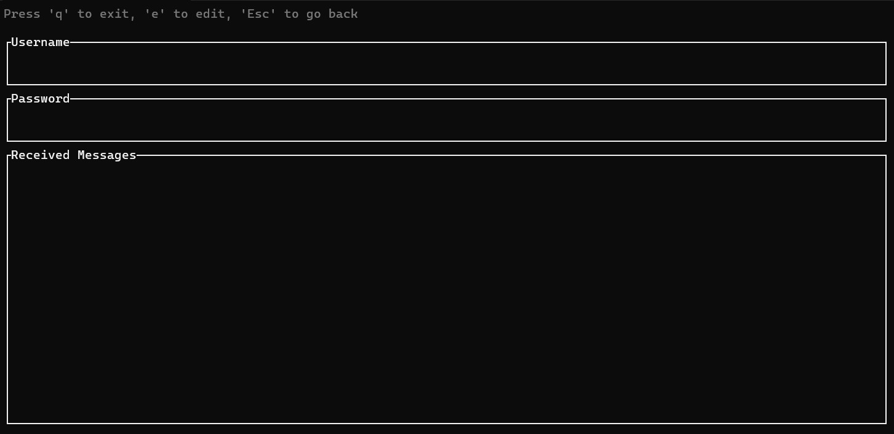

This is a program that takes a username and password and stores it for later use it's programmed in the [rust programming language](https://www.rust-lang.org/). This is due to it's fast compile time and guaranteed memory safety in it's program.

### Features

- Extensive user interface
- Created passwords must follow certain rules in order to be valid
- Stores passwords as a hash using the argon2 hashing algorithm

### Example of GUI

The user interface is made using the rust crate [ratatui](https://ratatui.rs/).

### How it works

The program communicates with a socket server after the user types in there **username** and **password**. It sends the information to the server and gets a response to a server which will either create an account or if the password doesn't follow rules like must be eight characters and must have a capital letter for example.
